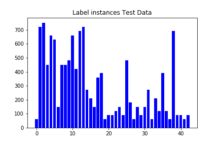
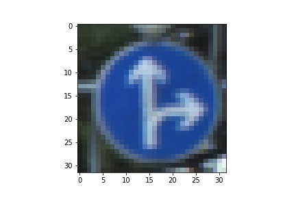
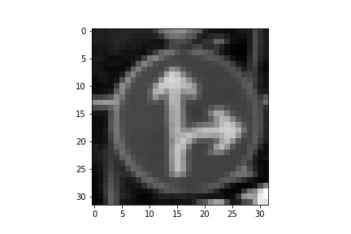
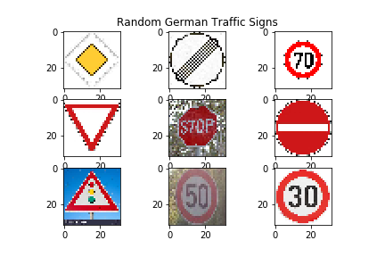

## Traffic Sign Recognition

### Set-up locally w/Anaconda
1. Install [Anaconda](https://docs.anaconda.com/anaconda/install/linux/)
2. Clone this repository: `git clone https://github.com/martinezedwin/TrafficSignClassifier.git`
3. Go into the project: `cd TrafficSignClassifier`
4. Create the conda environment: `conda env create -f environment.yml`
6. Activate the environment: `conda activate TrafficSignClassifier`

Data Set Summary and Exploration
---
#### Basic Summary of the Data Set

I used the numpy library to calculate summary statistics of the traffic signs data set:

The size of training set is 34799

The size of the validation set is 4410

The size of test set is 12630

The shape of a traffic sign image is (32, 32, 3)

The number of unique classes/labels in the data set is 43

The following are bargraphs of the number of times(y-axis) each label (x-axis) appears in each dataset (training, testing, validation).

Design and Test a Model Architecture
---

My pre-process consisted of first converting each image from color to grayscale. Then each image was also normalized.

Here is an image before process

and after

| Before |After |
|-------|-----------|
|| |

#### Final Model Architecture

The final model architecture was very similar to the LeNet-5 architecture. It looks like this:

| Layer         | Description                  |
|---------------|------------------------------|
|Input          | 32x32x1 image                |
|Convolutional  | 1x1 strides, output 28x28x6  |
|RELU           |                              |
|Max Pooling    | 2x2 strides, output 14x14x6  |
|Convolutional  | 1x1 strides, output 10x10x16 |
|RELU           |                              |
|Max Pooling    | 2x2 strides, output 5x5x16   |
|Flatten        | output should be 400         |
|Dropout        |                              |
|Fully connected| Output 120                   |
|RELU           |                              |
|Dropout        |                              |
|Fully connected| Output 84                    |
|RELU           |                              |
|Fully connected| Output 43                    |

The training took part in cells 17 - 21. I chose 50 epochs of the model with batch size of 128.

The learning rate was 0.0009.

I chose to edit the hyperparametrs first to see how they affected the performance of the initial LeNet-5 architecture. Once I had a feel of how they could adjust the performance I altered the architecture by adding layers and checking the performance after each addition and retuning hyperparameters. Sort of a trial and error based on experience in tuning the network. I chose to add dropout layers to help with overfitting.

#### Results

My final model results were:

training set accuracy of N/A
validation set accuracy of 96.2%
test set accuracy of 99.4%

Test a Model on New Images
---
Here are the ones I used.

#### Results

| Image |Prediction | Correct? |
|-------|-----------|-----------|
|Priority Road | Priority Road | Yes |
|End of all speed and passing limits | End of all speed and passing limits| Yes|
|Speed limit (70km/h) |Speed limit (70km/h) | Yes |
|Yield | Yield | Yes|
|Stop | Stop | Yes |
|No entry | No entry | Yes |
|Traffic signals | Wild animals crossing | No |
|Speed limit (50km/h)| Speed limit (30km/h) | No |
|Speed limit (30km/h)| Speed limit (30km/h) | Yes |

Accuracy is 77.77777777777779%. This accuracy is lower than that of the test or validation tests. Perhaps new ways to pr-process the data would help. Additional training data could also be useful.

#### Certainty of the model per prediction

| Probability |Prediction | Correct? |
|-------|-----------|-----------|
|0.83 | Priority Road | Yes |
|0.82 | End of all speed and passing limits| Yes|
|0.99 |Speed limit (70km/h) | Yes |
|1.00 | Yield | Yes|
|0.56 | Stop | Yes |
|1.00 | No entry | Yes |
|0.86 | Wild animals crossing | No |
|0.58 | Speed limit (30km/h) | No |
|0.94 | Speed limit (30km/h) | Yes |
