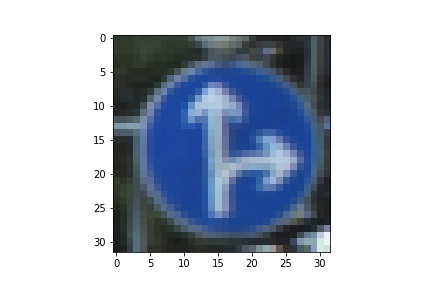
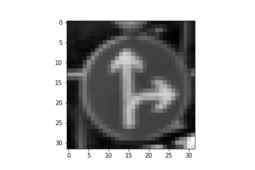
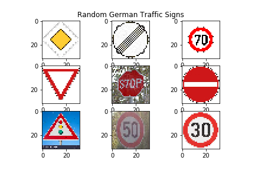

## Traffic Sign Recognition

Data Set Summary and Exploration
---
#### 1. Provide a basic summary of the data set. In the code, the analysis should be done using python, numpy and/or pandas methods rather than hardcoding results manually.

I used the numpy library to calculate summary statistics of the traffic signs data set:

The size of training set is 34799
The size of the validation set is 4410
The size of test set is 12630
The shape of a traffic sign image is (32, 32, 3)
The number of unique classes/labels in the data set is 43

#### 2. Include an exploratory visualization of the dataset.

The following are bargraphs of the number of times(y-axis) each label (x-axis) appears in each dataset (training, testing, validation).

Design and Test a Model Architecture
---
#### 1. Describe how you preprocessed the image data. What techniques were chosen and why did you choose these techniques? Consider including images showing the output of each preprocessing technique. Pre-processing refers to techniques such as converting to grayscale, normalization, etc. (OPTIONAL: As described in the "Stand Out Suggestions" part of the rubric, if you generated additional data for training, describe why you decided to generate additional data, how you generated the data, and provide example images of the additional data. Then describe the characteristics of the augmented training set like number of images in the set, number of images for each class, etc.)

My preprocess consisted of first converting each image from color to grayscale. Then each image was also normalized.

Here is an image before process

and after

#### 2. Describe what your final model architecture looks like including model type, layers, layer sizes, connectivity, etc.) Consider including a diagram and/or table describing the final model.

The final model architecture was very similar to the LeNet-5 architecture. It looks like this:

| Layer         | Description                  |
|---------------|------------------------------|
|Input          | 32x32x1 image                |
|Convolutional  | 1x1 strides, output 28x28x6  |
|RELU           |                              |
|Max Pooling    | 2x2 strides, output 14x14x6  |
|Convolutional  | 1x1 strides, output 10x10x16 |
|RELU           |                              |
|Max Pooling    | 2x2 strides, output 5x5x16   |
|Flatten        | output should be 400         |
|Dropout        |                              |
|Fully connected| Output 120                   |
|RELU           |                              |
|Dropout        |                              |
|Fully connected| Output 84                    |
|RELU           |                              |
|Fully connected| Output 43                    |

#### 3. Describe how you trained your model. The discussion can include the type of optimizer, the batch size, number of epochs and any hyperparameters such as learning rate.

The training took part in cells 17 - 21. I chose 50 epochs of the model with batch size of 128. 

The learning rate was 0.0009.

#### 4. Describe the approach taken for finding a solution and getting the validation set accuracy to be at least 0.93. Include in the discussion the results on the training, validation and test sets and where in the code these were calculated. Your approach may have been an iterative process, in which case, outline the steps you took to get to the final solution and why you chose those steps. Perhaps your solution involved an already well known implementation or architecture. In this case, discuss why you think the architecture is suitable for the current problem.

My final model results were:

training set accuracy of N/A
validation set accuracy of 96.2%
test set accuracy of 99.4%

##### If an iterative approach was chosen:

##### What was the first architecture that was tried and why was it chosen?
The first architecture chosen was standard LeNet-5 shown in the lectures.

##### What were some problems with the initial architecture?
The first problem I had was that it was not accurate enough.

##### How was the architecture adjusted and why was it adjusted? Typical adjustments could include choosing a different model architecture, adding or taking away layers (pooling, dropout, convolution, etc), using an activation function or changing the activation function. One common justification for adjusting an architecture would be due to overfitting or underfitting. A high accuracy on the training set but low accuracy on the validation set indicates over fitting; a low accuracy on both sets indicates under fitting.
I chose to edit the hyperparametrs first to see how they affected the performance of the initial LeNet-5 architecture. Once I had a feel of how they could adjust the performance I altered the architecture by adding layers and checking the performance after each addition and retuning hyperparameters. Sort of a trial and error based on experience in tuning the network. I chose to add dropout layers to help with overfitting.

Test a Model on New Images
---
#### 1. Choose five German traffic signs found on the web and provide them in the report. For each image, discuss what quality or qualities might be difficult to classify.

Here are the ones I used.

#### 2. Discuss the model's predictions on these new traffic signs and compare the results to predicting on the test set. At a minimum, discuss what the predictions were, the accuracy on these new predictions, and compare the accuracy to the accuracy on the test set (OPTIONAL: Discuss the results in more detail as described in the "Stand Out Suggestions" part of the rubric).

| Image |Prediction | Correcnt? |
|-------|-----------|-----------|
|Priority Road | Priority Road | Yes |
|End of all speed and passing limits | End of all speed and passing limits| Yes|
|Speed limit (70km/h) |Speed limit (70km/h) | Yes |
|Yield | Yield | Yes|
|Stop | Stop | Yes |
|No entry | No entry | Yes |
|Traffic signals | Wild animals crossing | No |
|Speed limit (50km/h)| Speed limit (30km/h) | No |
|Speed limit (30km/h)| Speed limit (30km/h) | Yes |

Accuracy is 77.77777777777779%

#### 3. Describe how certain the model is when predicting on each of the five new images by looking at the softmax probabilities for each prediction. Provide the top 5 softmax probabilities for each image along with the sign type of each probability. (OPTIONAL: as described in the "Stand Out Suggestions" part of the rubric, visualizations can also be provided such as bar charts)

| Probability |Prediction | Correcnt? |
|-------|-----------|-----------|
|0.83 | Priority Road | Yes |
|0.82 | End of all speed and passing limits| Yes|
|0.99 |Speed limit (70km/h) | Yes |
|1.00 | Yield | Yes|
|0.56 | Stop | Yes |
|1.00 | No entry | Yes |
|0.86 | Wild animals crossing | No |
|0.58 | Speed limit (30km/h) | No |
|0.94 | Speed limit (30km/h) | Yes |
